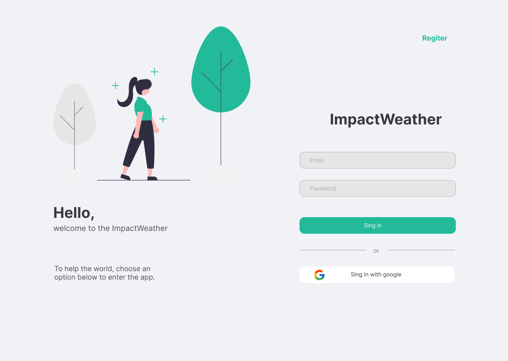
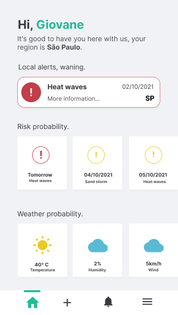
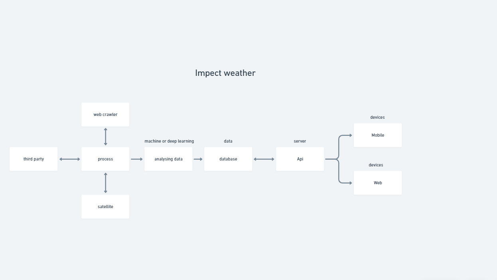

___
## Team: OnlyDucks

### We embrace the cause:
### WARNING: THINGS ARE HEATING UP!

___
### Files

- figma prototype: https://www.figma.com/file/ZjT0drpTKgWf2hTG5Xx3yU/Space-Apps
- Document abstract: https://github.com/onlyDucksH/hackhathon-nasa-global/blob/main/files/ImpactWather_PDF_Global.pdf
- Global video: https://www.youtube.com/watch?v=Gvc6AHEEqz0
- Local video: link

### Tobicos addressed
- Heat stress intensity duration levels
- Estimate potential human and environmental impacts
- Generate a heat stress risk alert level (red, yellow, green)
- For a selected area (eg city, county, country)
- Potential risk for one or more of the following: forest fires, air pollution, damage to crops, shortages of water and energy supplies.

## Problem and Solution

The impacts of climate change and natural disasters are evident globally. Heat waves are often associated with droughts and forest fires with billions of dollars in impacts on societies, becoming increasingly worrying. Heat waves, storms, lack of rain and droughts are increasing in frequency, intensity and duration, due to pollution, deforestation and global warming, impacting social and economic structures.
Thus, the issue addressed is the lack of concise and simple information, or information that is not readily accessible in the form of personalized notices/events, graphs, forecasts and statistics, which can help individuals and counties/cities to take preventive measures /mitigation and ensuring safety during the occurrence of natural disasters, with a focus on climate change and the extremes related to heat/air that affect human health and environmental and ecological systems.
Based on this issue, the project's ideation is the development of a mobile and global web tool that enjoys Earth Observations (EO), with the analytical analysis of satellite data and sensors to generate metrics, with crowdsourcing data (information and /or opinions posted by users to the app's open community), where each person, in their region, shares about the weather, with photos, and interactive information from radars and satellite maps, with warnings about the potential impacts of the events , with guidance on mitigation measures in an easy and practical way.
The software will make available on its dashboard real-time updated information on the duration levels of heat stress intensity, estimates on the potential and human/environmental impacts, in addition to generating risk and emergency alerts for events, such as:
Forest fires, storms, floods, pollution/air quality, damage to crops, shortages of water and energy supplies, among others;
Depending on the location selected by the user, viable for users who reside in dangerous regions and with a high environmental estimate of environmental catastrophes, in order to generate safety, well-being and awareness about global warming.

## Web

### Technology: React.js

The web platform is aimed at organizations responsible for the climate and their respective regions, where they can register as institutions and generate alerts with risk levels, report a weather problem, ask people in the region to stay at home, and even perform an evacuation if necessary, also containing an informational dashboard where they can see what is happening in their region of registration, allowing also to receive a record of events
reported by the user themselves and from that shoot to other people so that they do not run the risk of possible accidents.

### Functionalities:

- Registration of users to view information.
- Registration of responsible agencies for issuing customized alerts.
- Analytical dashboard to visualize deforestation, fires, drought etc...

## Mobile

### Technology: React-Native

The mobile platform is targeted to end users in order to make it easy and practical to receive an alert or visualize the data, enabling the recording of events occurring in cities and regions to avoid problems and disasters.

### Functionalities

- User registration.
- Register region.
- Manage data.
- Visualization of weather, temperature, humidity, wind speed.
- Visualization of risk events such as heat waves, tsunami, dust storms.
- Receive customized alerts providing security.
- Information for awareness:
  - Pollutions.
  - Plant trees.
  - Global warming.

## Backend

### Technologies: Node.js, Python, Mysql, Mongo

The back-end will consist of an API which will provide all data for both platforms, data collection will be done with micro-services extracting information from public domains, earth observations using satellites and sensors to provide the information, and by crowdsourced data reported by users and organizations.

### Functionalities

- Crowdsourced information collection.
- Integrations with public external APIs.
- Collects web crawler information from public domains.
- Collecting information from Earth observations, satellites, sensors.

## References

Nasa:

https://droughtmonitor.unl.edu/

https://data.giss.nasa.gov/gistemp/

Others

http://www.dgi.inpe.br/

https://www.cptec.inpe.br/

https://nadm-noaa.hub.arcgis.com/

http://terrabrasilis.dpi.inpe.br/

https://droughtmonitor.unl.edu/

https://gmao.gsfc.nasa.gov/GMAO_products/NRT_products.php

http://www2.dgi.inpe.br/catalogo/explore

https://queimadas.dgi.inpe.br/queimadas/bdqueimadas

https://www.sophia-mar.pt/uploads/GUIA_2_Observacao_da_Terra_temperature_e_cor_do_ocean.pdf